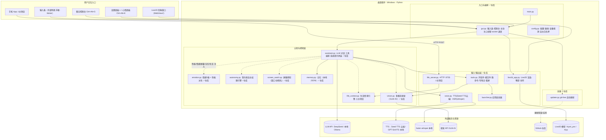
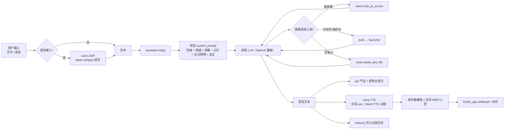
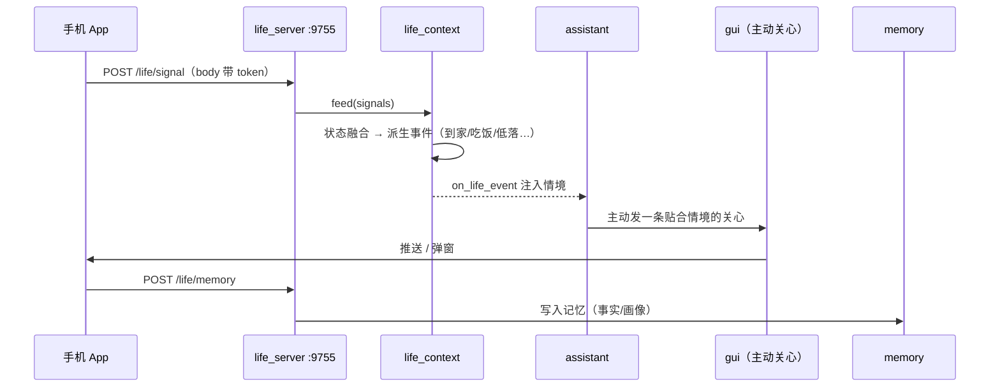
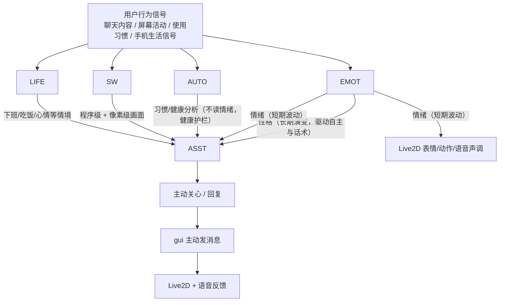
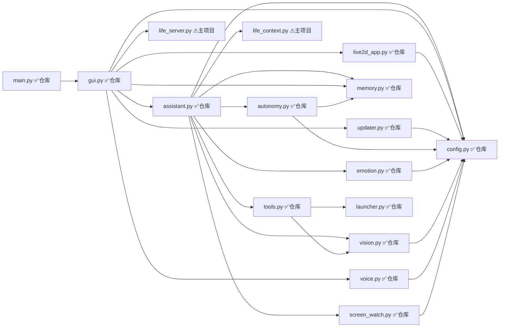
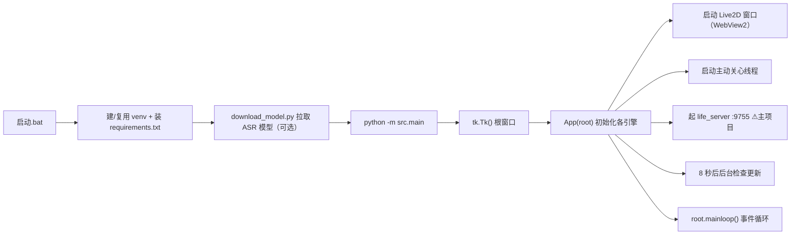

# 架构图 · 小念 AI 桌面女友

> 本图综合两个来源：**① 本仓库（GitHub 便携版 `ai桌面女友/ai-girlfriend`）的实际代码文件**；**② 与用户历史对话中记录的小念完整功能设计**（含主项目 `d:\AI训练\ai-girlfriend` 已实现、但本仓库尚未同步的「生活接入」等）。
> 技术栈：Python + tkinter（输入条/控制台） + WebView2 / Live2D（形象） + OpenAI 兼容 LLM + 语音（Seed-TTS 云端 / GPT-SoVITS 本地） + faster-whisper 本地识别 + 多模态视觉（GLM-4V）。
> 平台：Windows 桌面程序。

---

## 图例

- 🟦 实线箭头 `-->`：主调用 / 数据流（一次调用链上的硬依赖）。
- 🟪 点线箭头 `-.->`：认知注入（情绪/性格/屏幕/记忆/生活等"软信号"进入对话，并非每次都触发）。
- ⬜ 开放连线 `---`：同进程内的组件关联（如 Live2D 窗口 ↔ 渲染引擎）。
- 模块徽标：`✅仓库` = 已在本 GitHub 仓库 `src/` 中；`⚠主项目` = 仅主项目 `d:\AI训练\ai-girlfriend` 实现，本仓库**未含**（需同步才具备）。

---

## 0. 多副本差异（历史对话核心）

小念有多个本地副本，架构相同但能力/资源不同：

| 副本 | 路径 | 语音 TTS | Live2D | 生活接入(手机) | LLM |
|---|---|---|---|---|---|
| **便携版（GitHub）** | `ai桌面女友/ai-girlfriend` | 字节 Seed-TTS 云端 | hiyori_pro（可商用） | ❌ 未含 | DeepSeek / 兼容 |
| 主项目 | `d:\AI训练\ai-girlfriend` | Seed-TTS（已切） | Xiyu（非商用） | ✅ 已实现 | DeepSeek / 兼容 |
| 本地版 | `d:\AI训练\ai-girlfriend-本地版` | GPT-SoVITS 本地 | Xiyu | ❌ 未含 | 本地 Ollama |
| 备份 | `ai-girlfriend-备份-20260717` | GPT-SoVITS 本地 | Xiyu | ❌ 未含 | DeepSeek |

> 图里凡标 `⚠主项目` 的模块，本 GitHub 仓库当前没有。

---

## 1. 小念完整系统总览

---

## 2. 一次对话与响应的数据流

---

## 3. 生活接入链路（手机 → 主动关心）⚠主项目独有

> 仅主项目 `d:\AI训练\ai-girlfriend` 实现，本 GitHub 仓库未含。

控制台「生活感知」面板有模拟按钮（走 `simulate()` 强制触发，绕过冷却，便于测试）。

---

## 4. 认知引擎如何注入对话（情绪/性格/自主/屏幕/生活）

设计要点：**情绪**只影响聊天语气与动作表情；**性格**由情绪长期累计派生，额外驱动自主行为与话术；**自主（autonomy）的 analyze 只依据习惯/健康信号，不读情绪**，避免被情绪带偏。

---

## 5. 模块依赖关系（src，标注归属）

> 本 GitHub 仓库 `src/` 实际文件（共 14 个）：`assistant / autonomy / config / emotion / gui / launcher / live2d_app / main / memory / screen_watch / tools / updater / vision / voice`。其中 `life_context / life_server` 不在仓库内（见第 0 节）。

根目录辅助模块：`seedtts_presets.py`（5 种云端 AI 音色预设）、`live2d_models.py`（Live2D 模型注册）、`download_model.py`（拉取 ASR 模型）、`启动.bat`（一键自举 venv/依赖）。

---

## 6. 启动流程

---

## 7. 外部依赖与数据文件

### 外部服务
| 能力 | 服务 | 说明 |
|---|---|---|
| 对话 LLM | DeepSeek / 本地 Ollama | OpenAI 兼容接口 |
| 语音输出 TTS | 字节 Seed-TTS 云端（火山引擎） / GPT-SoVITS 本地 | 便携版=Seed-TTS 云端 AI 音色（非克隆） |
| 语音输入 ASR | faster-whisper（本地） | 离线识别，模型在 `models/faster-whisper-*` |
| 多模态视觉 | 智谱 GLM-4V-Flash（可换本地 llama3.2-vision） | 看懂屏幕画面 |
| 形象 | Live2D：hiyori_pro（便携版，可商用）/ Xiyu（主项目，非商用） | 位于 `assets/live2d/` |
| 自动更新源 | GitHub 仓库 | `updater.py` 走 git tree 比对，git-free |
| 生活接入（主项目） | 手机 App → `life_server` :9755 | 需 Tailscale/同网，暂未做手机端 |

### 本地数据 / 配置
| 文件 | 作用 |
|---|---|
| `data/memory.json` | 对话历史 / 事实 / 用户画像 |
| `data/autonomy_overrides.json` | 小念自主微调过的参数记录 |
| `data/input_style.json` | 输入条位置/颜色/透明度 |
| `data/screen_watch/` | 屏幕截图（视觉用） |
| `.update_manifest.json` / `.update_backup/` | 自动更新状态与回滚备份 |
| `.env` / `.env.example` | 运行配置（密钥、开关、模型） |
| `seedtts_presets.py` / `live2d_models.py` | 音色预设 / 形象注册 |
